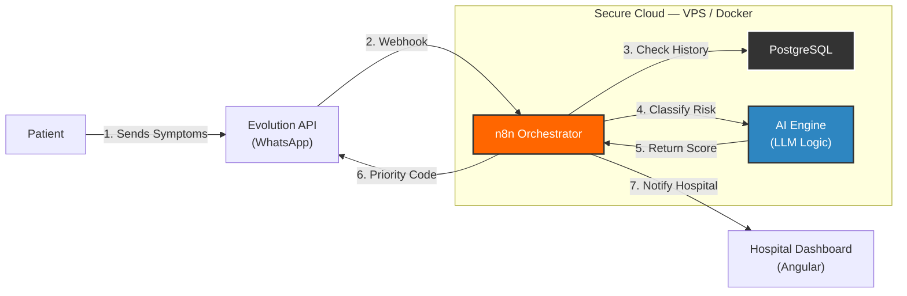

  

  

  

    
    
    
  

---

## 👨‍💻 Engineering First

I am a **Software Engineer in the making** at **UFMG (Federal University of Minas Gerais)** with strong **production experience**.

Unlike many students, I have architected and maintained **real-world systems**, including **Multi-tenant SaaS platforms**, **Cloud Infrastructure (Azure / AWS)**, and **containerized deployments**. I focus on building software that is **scalable, secure, and maintainable**, always thinking in terms of architecture, not just code.

While my core strength lies in **Full Stack Engineering**, I am actively integrating **Artificial Intelligence** and **automation workflows** to create intelligent, data-driven systems.

- 🔭 **Expertise:** SaaS Architecture, REST APIs, CI/CD Pipelines
- 💼 **Experience:** Full Stack Developer working with Embedded Analytics
- 🏆 **Achievement:** 1st Place — *Unimed Innovation Challenge*

---

## 🧩 System Architecture Showcase

**Project:** *Intelligent Triage System (Unimed)*  
This architecture diagram is rendered natively by GitHub using **Mermaid.js** and represents the **real orchestration flow** of an award-winning healthcare project.

---

## 🛠️ Interactive Tech Stack

*Click to expand each category.*

<b>☁️ Cloud & DevOps</b>

 

  
  
  
  
  

Experience managing VPS, Serverless Functions, CI/CD pipelines, and containerized environments.

<b>💻 Backend & Architecture</b>

 

  
  
  
  
  

Designing robust REST APIs, optimized SQL schemas, and high-performance caching layers.

<b>🎨 Frontend</b>

 

  
  
  

Building responsive, component-based user interfaces with strong UX focus.

<b>🤖 Data & AI</b>

 

  
  
  
  

Applying engineering discipline to Machine Learning and intelligent workflow orchestration.

---

## 🚀 Highlighted Projects

<table width="100%">
<tr>
<td width="50%">

### 🏥 Intelligent Triage System

*Winner — Unimed Innovation Challenge*

AI-powered hospital triage system that automates patient prioritization via WhatsApp.

**Tech Stack**

* n8n (Workflow Orchestration)
* LLM-based Risk Classification
* Evolution API (WhatsApp)
* Angular Dashboard
* Docker + Redis

</td>

<td width="50%">

### 📊 SaaS Analytics Platform

*Professional Project — PRS Tecnologia*

Multi-tenant SaaS platform for embedded analytics and corporate reporting.

**Tech Stack**

* Django REST Framework
* Microsoft Azure (Serverless)
* PostgreSQL (Multi-tenant)
* Automated CI/CD Pipelines

</td>
</tr>
</table>

---

## 📈 Engineering Metrics

  

 

  
  

 

<picture align="center">
  <source media="(prefers-color-scheme: dark)" srcset="https://raw.githubusercontent.com/Guinhoal/Guinhoal/output/github-contribution-grid-snake-dark.svg">
  <source media="(prefers-color-scheme: light)" srcset="https://raw.githubusercontent.com/Guinhoal/Guinhoal/output/github-contribution-grid-snake.svg">
  
</picture>
